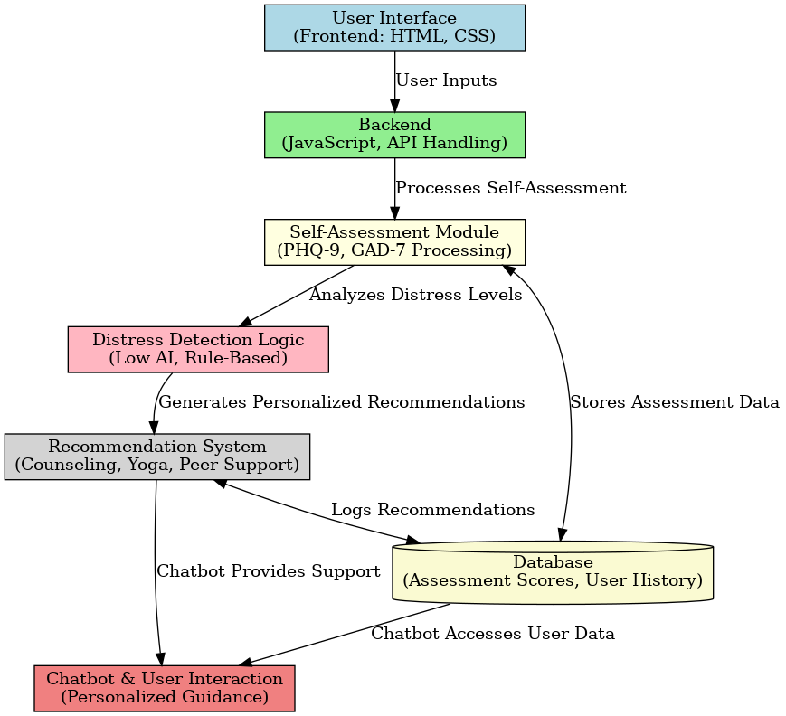

# 🧠 MindSpace – A Web-Based Mental Health Monitoring System

**MindSpace** is a privacy-focused, logic-driven mental health monitoring system tailored for students. Developed during the **Burn Brain Hackathon at NIT Durgapur** by Team **CodeCrafters**, MindSpace empowers users to take control of their mental well-being through anonymous assessments, personalized recommendations, and chatbot support—all without the bias of AI-based analysis.

🔗 **Live Project:** [https://tjayush.github.io/MENTAL-HEALTH/](https://tjayush.github.io/MENTAL-HEALTH/)  
📂 **GitHub Repository:** [https://github.com/tjayush/MENTAL-HEALTH](https://github.com/tjayush/MENTAL-HEALTH)

---

## 📘 Table of Contents

- [Features](#features)
- [Why MindSpace?](#why-mindspace)
- [Technology Stack](#technology-stack)
- [Architecture & Workflow](#architecture--workflow)
- [Challenges & Learnings](#challenges--learnings)
- [Future Scope](#future-scope)
- [Team](#team)
- [License](#license)

---

## ✨ Features

- 🧪 **Anonymous Self-Assessment**  
  PHQ-9 and GAD-7 based quizzes to evaluate depression and anxiety levels without stigma.

- 🧠 **Logic-Driven Distress Detection**  
  A rule-based system to identify mental distress more accurately, avoiding common AI pitfalls.

- 💬 **24/7 Chatbot Assistance**  
  An always-available chatbot offering emotional support and wellness tips.

- 🎯 **Personalized Recommendations**  
  Customized guidance including counseling, peer support, yoga, structured routines, and more.

- 🕹️ **Gamification (Upcoming)**  
  Daily challenges, streaks, and rewards to encourage consistent mental health check-ins.

- 📹 **Interactive Video Prompts** *(Prototype)*  
  A more engaging, humanized way to understand user emotions.

- 📞 **Crisis-Ready Redirection**  
  Immediate access to helplines during high-risk situations.

---

## 💡 Why MindSpace?

Unlike traditional mental health tools that rely heavily on AI sentiment analysis (often inaccurate or biased), **MindSpace** uses a **logic-based system** to evaluate user input, ensuring reliability, transparency, and fairness.

### What Sets It Apart:
- ✅ No account or login required – ensuring **anonymity**
- ✅ No data storage – preserving **privacy**
- ✅ Lightweight – easy to scale in **institutions & colleges**
- ✅ Holistic – focuses on both emotional and lifestyle wellness

---

## 🛠️ Technology Stack

| Component     | Technology              |
|---------------|--------------------------|
| **Frontend**  | HTML, CSS                |
| **Backend**   | JavaScript               |
| **APIs Used** | Web3Forms, Gemini        |
| **Hosting**   | GitHub Pages             |

---

## 🧱 Architecture & Workflow

Here is the overall architecture of the MindSpace platform, illustrating user interaction, assessment flow, logic analysis, and response generation.

<!-- Replace the above URL with the actual image path in your repo -->

---

## 🚧 Challenges & Learnings

- Fine-tuning chatbot responses for clarity and conciseness.
- Structuring rule-based detection logic to be scalable and accurate.
- Designing UI/UX that encourages user retention without signups or notifications.

---

## 🚀 Future Scope

- 🔗 **Integration with Therapists**: Real-time therapist chat or appointment booking.
- 🧠 **AI-Driven Analysis**: Optional AI model for deeper emotional understanding.
- 📲 **Mobile App**: Companion app with mood tracking and push notifications.
- 📘 **Mental Health Journaling**: Daily entries, visual emotion tracking, and mood analytics.

---

## 👨‍💻 Team – CodeCrafters  
**Developed during the Burn Brain Hackathon at NIT Durgapur**

| Name             | Role Description                                                       |
|------------------|-------------------------------------------------------------------------|
| **Ayushman Sarkar** *(Team Leader)* | Backend Development, Research, Frontend, Chatbot Integration       |
| **Anisha Nag**    | UI Design, Presentation (PPT)                                           |
| **Barnali Mandal**| Testing & Debugging                                                     |
| **Joyjeet Das**   | Documentation, Support, Image & Video Content Collection                |

🎓 **Birbhum Institute of Engineering and Technology**

---

## 📜 License

This project is licensed under the **MIT License** – see the [LICENSE](LICENSE) file for details.

---

## 📣 Acknowledgements

- [PHQ-9 Depression Assessment](https://www.apa.org)
- [GAD-7 Anxiety Assessment](https://www.apa.org)
- [Healio Mental Health Research](https://journals.healio.com)
- [The Journal: Student Mental Health](https://thejournal.com)

---

> “**MindSpace** is more than an app—it's a safe space for students to listen to their minds, take action, and seek support with dignity.”
